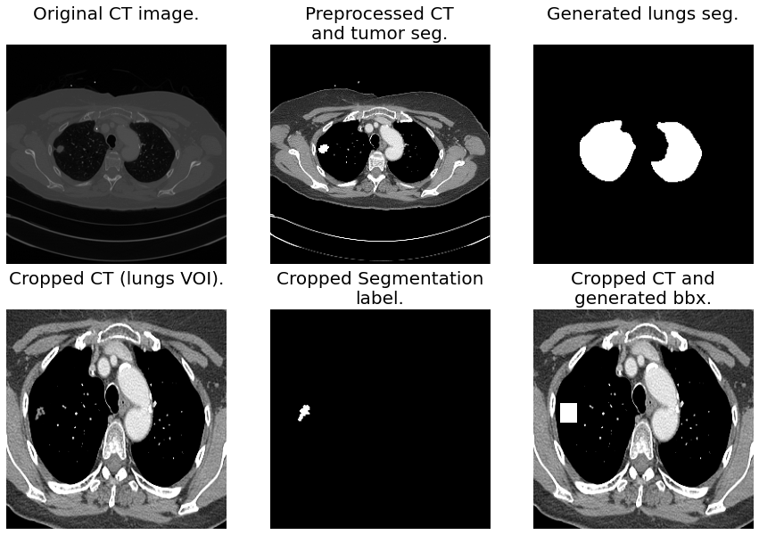
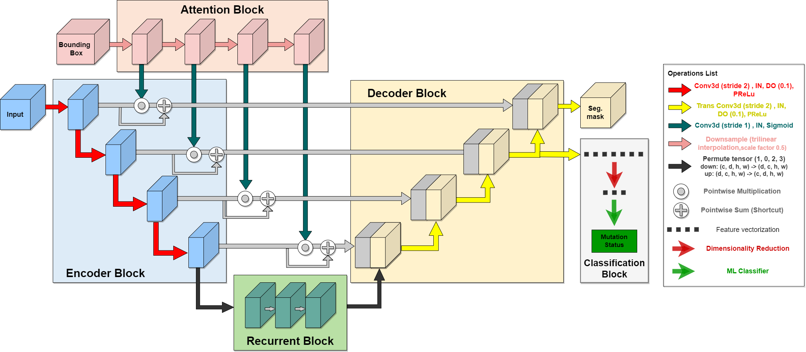
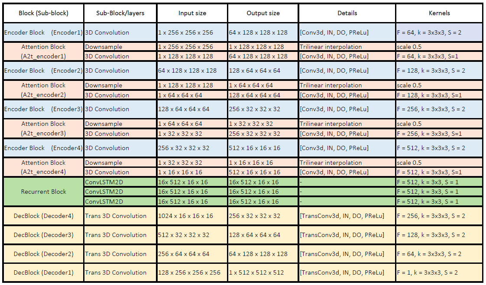
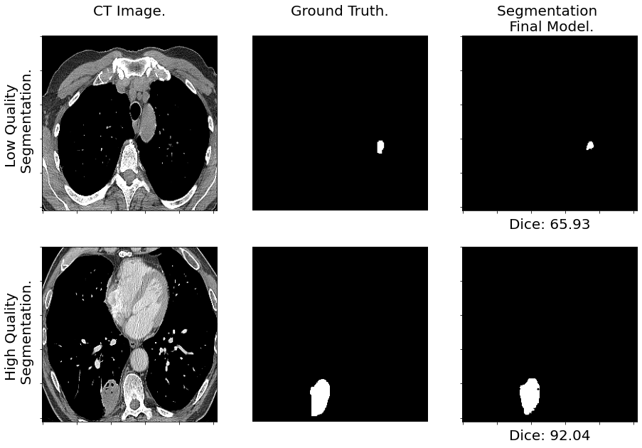

# A Radiogenomics Pipeline for Lung Nodules Segmentation and Prediction of EGFR Mutation Status from CT Scans.

This is the official repository for the **Preprint** "A Radiogenomics Pipeline for Lung Nodules Segmentation and Prediction of EGFR Mutation Status from CT Scans". 

**Link:** [ArXiv](https://arxiv.org/abs/2211.06620)

**Abstract**

Lung cancer is a leading cause of death worldwide. Early-stage detection of lung cancer is essential for a more favorable prognosis. Radiogenomics is an emerging discipline that combines medical imaging and genomics features for modeling patient outcomes non-invasively. This study presents a radiogenomics pipeline that has: 1) a novel mixed architecture (RA-Seg) to segment lung cancer through attention and recurrent blocks; and 2) deep feature classifiers to distinguish Epidermal Growth Factor Receptor (EGFR) mutation status. We evaluate the proposed algorithm on multiple public datasets to assess its generalizability and robustness. We demonstrate how the proposed segmentation and classification methods outperform existing baseline and SOTA approaches (73.54 Dice and 93 F1 scores).

## Dependencies
In addition to the python packages, [lungmask](https://github.com/JoHof/lungmask) is required.
```
pip install -r requirements.txt
```

## Preprocessing
*Preprocess* argument prepares the data as available from their sources, data is normalized and stored as tensor for training or inference.
Preprocessing is available for public dataset: [MSD](http://medicaldecathlon.com/) Task6_Lung, [NSCLC Radiomics](https://wiki.cancerimagingarchive.net/display/Public/NSCLC-Radiomics) (RAD), and [NSCLC Radiogenomics](https://wiki.cancerimagingarchive.net/display/Public/NSCLC+Radiogenomics) (RADGEN).

For other datasets user must create the corresponding function making sure first axis contains slices, second axis goes from chest to back, and third axis from right to left.

**Preprocessing:**
* Voxel Intensity clipped to the range [-200, 250].
* Min-max normalization to the range [0, 1].
* Resampling to anisotropic resolution 1x1x1.5 mm^3.
* Lungs Volume of Interest (VOI) crop utilizing [U-Net(R231)](https://github.com/JoHof/lungmask) pretrained weights.
* Resize to 256×256×256 using b-spline for the image and nearest interpolation for the segmentation.
* Generation of 3D bounding boxes using the tumor segmentation mask.

```
cd radiogenomics

python main.py preprocess RAW_DATA_PATH PREPROCESSED_DATA_OUTPUT DATASET
python main.py preprocess ./data/MSD/Task06_Lung ./data/MSD/processed msd
```

Illustrated example of data preprocessing:


## Segmentation. Lung tumor segmentation.
"Residual-Attention Segmentor" (RA-Seg) architecture combines the core concepts of three models:
* [Volumentric U-NET](https://link.springer.com/chapter/10.1007/978-3-319-46723-8_49)
* [Recurrent 3D-DenseUNet](https://link.springer.com/chapter/10.1007/978-3-030-62469-9_4)
* [Organ-to-lesion (O2L) module](https://arxiv.org/abs/2010.12219)

The proposed “Recurrence-Attention Segmentor” (RA-Seg) generates a tumor mask with a U-Net like structure, the introduction of an Atenttion block to recalibrate the skip connections, and a Recurrent Block to capture slice interdependencies of the CT.

**The architecture of the proposed model**:


**Architecture outline and details:**


## Segmentation Inference. Lung tumor segmentation mask.
Segmentation results:
* Trained on MSD. Average DSC 67.24 (5 fold CV) and 68.65 on RADGEN testset.
* Trained on RAD. Average DSC 72.36 (5 fold CV) and 66.11 on RADGEN testset.
* Trained on MSD+RAD. Average DSC 71.42 (5 fold CV) and 73.54 on RADGEN testset.
* Trained on RADGEN with pretrained weights (MSD+RAD). Average DSC 75.26 (5 fold CV).

Available pretrained weight:
* Trained on RADGEN with pretrained weights (MSD+RAD).


Inference command will save tumor mask for preprocessed data available on DATA_PATH and extract the high-level raw features (NO dimensionality reduction). File structure:
```
DATA PATH
|____ CASE1
            required:
|____ |____ INPUT.pt
|____ |____ TUMOR_BBX.pt
            generated:
|____ |____ TUMOR_SEG.npy
|____ |____ RAW_FEATS.npy
|
|____ CASE2
|____ |____ INPUT.pt
|____ |____ TUMOR_BBX.pt
|____ |____ TUMOR_SEG.npy
|____ |____ RAW_FEATS.npy
|____ CASE3
.
.
.
```

Command Example:

```
cd radiogenomics # Make sure you are on the right directory.

python main.py inf_seg DATA_PATH WEIGHTS_PATH MODEL
python main.py inf_seg ./data/radgen/processed/lungs_roi ./weights/radgen_finetune.pt RA_Seg
```


## Classification. EGFR mutation status classification.
Highl-level deep features are extracted from the *Decoder 2* step output. Then undergo preprocessing (mean and flatten operation) with LDA dimensionality reduction.

Classification results:
* Quadratic discriminant analysis (QDA). Average ROC-AUC 0.90 (5 fold CV)
* Decision Tree (DT). Average ROC-AUC 0.91 (5 fold CV)
* Random Forest (RF). Average ROC-AUC 0.93 (5 fold CV)
* C-Support Vector Classification (SVC). Average ROC-AUC 0.83 (5 fold CV)

Classifiers available as SAV files:
* QDA
* DT
* RF
* SVC

Inference command will return the prediction of EGFR mutation status. Class-negative corresponds to "Wildtype" and Class-positive corresponds to "Mutated".
```
cd radiogenomics # Make sure you are on the right directory.

python main.py inf_class DATA_PATH SAVED_MODELS_PATH MODEL
python main.py inf_class ./data/radgen/processed/lungs_roi ./classifiers qda
```
